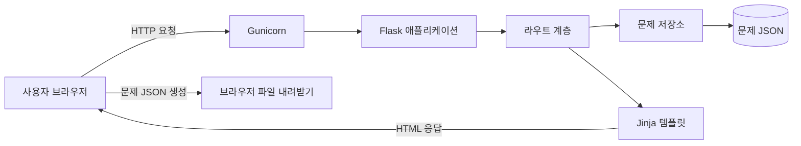
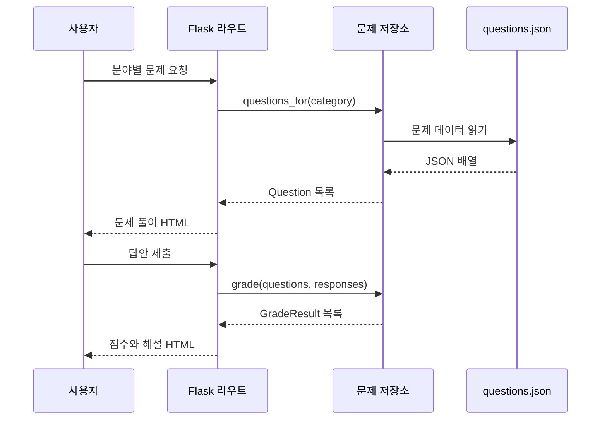

# 시스템 아키텍처

## 1. 목적

이 프로젝트는 머신러닝 수업의 중간고사 범위를 분야별로 복습하는 웹 애플리케이션이다. 사용자는 객관식 문제를 풀고 즉시 채점 결과와 해설을 확인할 수 있다. 별도의 문제 작성 화면에서는 문제 한 개를 JSON 형식으로 내려받을 수 있다.

현재 문제 범위는 다음과 같다.

- 머신러닝 기초
- 데이터와 피처
- NumPy
- pandas
- 데이터 시각화

## 2. 전체 구성



애플리케이션은 서버 측 렌더링 방식으로 동작한다. 서버는 문제 조회와 채점을 담당하고, 화면은 Jinja 템플릿을 통해 HTML로 생성한다. 데이터베이스는 사용하지 않으며 문제 데이터는 UTF-8 JSON 파일에서 읽는다.

## 3. 디렉터리와 책임

| 경로 | 책임 |
| --- | --- |
| `app/__init__.py` | 애플리케이션 팩토리 생성, 경로 설정, 문제 저장소 주입, 블루프린트 등록 |
| `app/routes.py` | HTTP 요청 처리, 문제 조회, 채점 요청 연결, 템플릿 렌더링 |
| `app/services/question_repository.py` | JSON 로드 및 검증, 분야별 조회, 답안 채점 |
| `data/questions.json` | 객관식 문제와 정답 및 해설 저장 |
| `templates/` | 홈, 문제 풀이, 결과, 문제 작성 화면의 HTML 템플릿 |
| `static/` | 공통 스타일과 문제 JSON 생성 스크립트 |
| `tests/` | 주요 화면과 채점 흐름에 대한 자동화 테스트 |
| `wsgi.py` | Gunicorn이 불러오는 WSGI 진입점 |
| `Dockerfile` | Python 3.13 기반 운영 이미지 정의 |
| `docker-compose.yml` | 웹 서비스 실행 및 호스트 포트 연결 |

## 4. 애플리케이션 계층

### 웹 계층

`app/routes.py`의 Flask 블루프린트가 요청을 받는다. 웹 계층은 입력 분야를 확인하고 저장소에 조회 또는 채점을 요청한 뒤, 결과를 템플릿에 전달한다.

| 방식 | 경로 | 동작 |
| --- | --- | --- |
| `GET` | `/` | 분야별 문제 수와 학습 시작 화면 표시 |
| `GET` | `/quiz?category={분야}` | 선택한 분야 또는 전체 문제 표시 |
| `POST` | `/result` | 제출한 답안을 채점하고 해설 표시 |
| `GET` | `/question-form` | 문제 데이터 작성 양식 표시 |

존재하지 않는 분야의 문제를 요청하면 `404` 응답을 반환한다.

### 서비스 및 데이터 계층

`QuestionRepository`가 문제 데이터 접근과 채점을 한곳에서 담당한다.

1. `pathlib.Path`로 `data/questions.json`을 UTF-8로 읽는다.
2. 최상위 배열, 필수 필드, 선택지, 정답 인덱스와 문자열 타입을 검증한다.
3. 검증한 값을 불변 데이터 클래스인 `Question`으로 변환한다.
4. 분야별 조회 결과 또는 `GradeResult` 채점 결과를 반환한다.

문제 데이터는 다음 필드를 사용한다.

| 필드 | 형식 | 설명 |
| --- | --- | --- |
| `id` | 문자열 | 문제를 구분하는 고유 식별자 |
| `category` | 문자열 | URL과 필터에 사용하는 분야 식별자 |
| `category_name` | 문자열 | 화면에 표시하는 분야 이름 |
| `prompt` | 문자열 | 문제 내용 |
| `choices` | 문자열 배열 | 두 개 이상의 선택지 |
| `answer` | 정수 | 0부터 시작하는 정답 선택지 인덱스 |
| `explanation` | 문자열 | 채점 후 표시하는 해설 |

## 5. 주요 요청 흐름

### 문제 풀이와 채점



### 문제 데이터 작성

문제 작성 화면은 입력값을 서버에 저장하지 않는다. 브라우저의 자바스크립트가 입력값을 JSON 파일로 변환해 내려받으며, 검토한 데이터를 `data/questions.json` 배열에 추가해야 실제 문제은행에 반영된다.

## 6. 배포 구조

Docker 이미지는 `python:3.13-slim`을 기반으로 하며 Gunicorn을 통해 애플리케이션을 실행한다.

- 컨테이너 내부 포트: `8000`
- Gunicorn 워커: `1`
- 워커 스레드: `4`
- 요청 제한 시간: `30초`
- 실행 사용자: 비루트 사용자 `appuser`
- 재시작 정책: `unless-stopped`

워커 수는 Cafe24 서버의 1GB RAM 제한을 고려한 값이다. 현재 Compose 구성은 호스트의 `8000` 포트를 직접 공개한다. `yangsong.cloud`에서 HTTPS로 서비스하려면 운영 서버 앞단에 리버스 프록시와 TLS 인증서 구성이 추가로 필요하다.

## 7. 상태와 보안 경계

- 로그인, 세션, 쿠키와 사용자별 학습 기록을 사용하지 않는 무상태 구조다.
- 답안과 점수는 요청 처리 중에만 사용하며 서버에 저장하지 않는다.
- 문제 작성 화면의 입력값도 서버로 전송하거나 저장하지 않는다.
- 비밀키, 비밀번호, API 토큰은 코드와 이미지에 포함하지 않는다.
- 운영 컨테이너는 비루트 사용자로 실행한다.

## 8. 검증 방법

로컬 자동화 테스트는 다음 명령으로 실행한다.

```powershell
.\.venv\Scripts\python.exe -m pytest -q
```

컨테이너 구성은 다음 명령으로 빌드하고 실행한다.

```powershell
docker compose up --build -d
```

현재 자동화 테스트는 홈 화면의 분야 표시와 답안 제출 후 채점 결과를 검증한다. 배포 검증에서는 주요 경로의 HTTP 상태, 잘못된 분야의 `404` 응답, 컨테이너 실행 사용자와 Gunicorn 로그를 함께 확인한다.

## 9. 확장 시 고려 사항

- 문제 수가 커지거나 운영 중 문제 편집이 필요해지면 JSON 저장소를 데이터베이스 저장소로 교체한다.
- 사용자별 오답 기록이 필요해지면 인증과 영속 저장 계층을 별도로 추가한다.
- 서버에서 문제를 수정하는 관리 기능을 추가할 때는 관리자 인증, CSRF 방어, 입력값 검증과 변경 이력을 함께 설계한다.
- 실제 도메인 배포 시 리버스 프록시, HTTPS, 접근 로그, 백업 및 상태 확인 경로를 추가한다.
