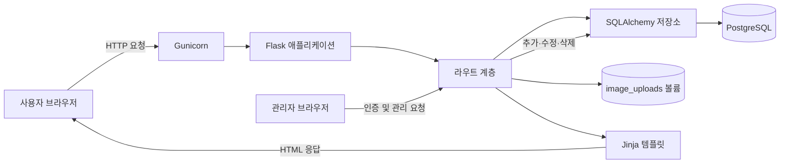
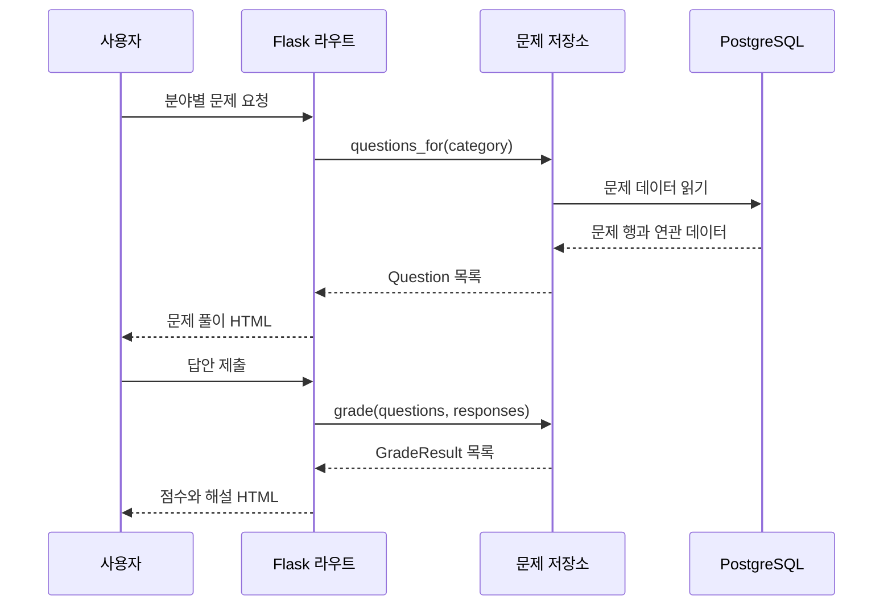

# 시스템 아키텍처

## 1. 목적

이 프로젝트는 머신러닝 수업의 중간고사 범위를 분야별로 복습하는 웹 애플리케이션이다. 사용자는 객관식과 주관식 문제를 풀고 즉시 채점 결과와 해설을 확인할 수 있다. 비밀번호로 보호된 관리 화면에서는 문제를 추가, 수정, 삭제할 수 있다.

현재 문제 범위는 다음과 같다.

- 머신러닝 기초
- 데이터와 피처
- NumPy
- pandas
- 데이터 시각화

## 2. 전체 구성



애플리케이션은 서버 측 렌더링 방식으로 동작한다. 서버는 문제 조회, 채점, 관리자 인증과 문제 관리를 담당하고, 화면은 Jinja 템플릿을 통해 HTML로 생성한다. 운영 데이터는 PostgreSQL에 저장하고 SQLAlchemy 2.x 저장소를 통해 접근한다.

## 3. 디렉터리와 책임

| 경로 | 책임 |
| --- | --- |
| `app/__init__.py` | 애플리케이션 팩토리 생성, 데이터베이스와 저장소 주입, 블루프린트 등록 |
| `app/database.py` | SQLAlchemy 엔진과 제한된 연결 풀 구성 |
| `app/models.py` | 분야, 문제, 선택지, 주관식 정답 ORM 모델 |
| `app/routes.py` | HTTP 요청 처리, 문제 조회, 채점 요청 연결, 템플릿 렌더링 |
| `app/admin_routes.py` | 관리자 로그인, CSRF 검증, 문제 추가·수정·삭제 요청 처리 |
| `app/services/database_repositories.py` | 분야와 문제의 PostgreSQL 조회 및 변경 |
| `app/services/category_repository.py` | 분야 도메인 객체와 이전 JSON 판독 지원 |
| `app/services/question_repository.py` | 문제 도메인 객체, 채점과 이전 JSON 판독 지원 |
| `app/services/image_processor.py` | 업로드 이미지 검증과 메타데이터 제거 재인코딩 |
| `app/services/image_storage.py` | 검증된 이미지의 파일 저장, 안전한 경로 해석과 삭제 |
| `app/image_migrator.py` | 기존 PostgreSQL 이미지 바이트를 영속 파일 볼륨으로 이전 |
| `app/json_importer.py` | 기존 JSON을 빈 데이터베이스에 한 번만 이전 |
| `app/services/login_attempt_tracker.py` | 접속 주소별 로그인 실패 횟수 및 임시 차단 관리 |
| `data/questions.json` | 새 환경을 위한 기본 문제 이전 원본 |
| `data/categories.json` | 새 환경을 위한 기본 분야 이전 원본 |
| `migrations/` | Alembic 데이터베이스 스키마 변경 이력 |
| `templates/` | 공개 화면과 관리자 화면의 HTML 템플릿 |
| `static/` | 공통 스타일과 문제 JSON 생성 스크립트 |
| `tests/` | 주요 화면과 채점 흐름에 대한 자동화 테스트 |
| `wsgi.py` | Gunicorn이 불러오는 WSGI 진입점 |
| `Dockerfile` | Python 3.13 기반 운영 이미지 정의 |
| `docker-compose.yml` | 웹, 마이그레이션, PostgreSQL 서비스 구성 |

## 4. 애플리케이션 계층

### 웹 계층

`app/routes.py`의 Flask 블루프린트가 요청을 받는다. 웹 계층은 입력 분야를 확인하고 저장소에 조회 또는 채점을 요청한 뒤, 결과를 템플릿에 전달한다.

| 방식 | 경로 | 동작 |
| --- | --- | --- |
| `GET` | `/` | 분야별 문제 수와 학습 시작 화면 표시 |
| `GET` | `/quiz?category={분야}` | 선택한 분야 또는 전체 문제 표시 |
| `POST` | `/result` | 제출한 답안을 채점하고 해설 표시 |
| `GET` | `/questions/{문제 ID}/image` | 문제 이미지를 ETag 캐시와 함께 반환 |
| `GET` | `/questions/{문제 ID}/content-images/{슬롯}` | 본문에 배치한 최대 5개 이미지를 ETag 캐시와 함께 반환 |
| `GET` | `/questions/{문제 ID}/choices/{순서}/image` | 객관식 선택지 이미지를 ETag 캐시와 함께 반환 |
| `GET` | `/question-form` | 문제 데이터 작성 양식 표시 |
| `GET`, `POST` | `/admin/login` | 관리자 비밀번호 확인 및 세션 시작 |
| `GET` | `/admin?category={분야}&page={번호}` | 분야별 필터와 페이지가 적용된 문제 목록 및 관리 작업 표시 |
| `GET`, `POST` | `/admin/categories/new` | 새 분야 입력 및 저장 |
| `GET`, `POST` | `/admin/questions/new` | 문제 추가 폼 표시 및 저장 |
| `GET`, `POST` | `/admin/questions/{문제 ID}/edit` | 기존 문제 수정 |
| `GET`, `POST` | `/admin/questions/{문제 ID}/delete` | 삭제 확인 및 삭제 |
| `POST` | `/admin/logout` | 관리자 세션 종료 |

존재하지 않는 분야의 문제를 요청하면 `404` 응답을 반환한다.

### 서비스 및 데이터 계층

`QuestionRepository`가 문제 데이터 접근과 채점을 한곳에서 담당한다.

1. 요청마다 짧은 SQLAlchemy 세션을 열어 PostgreSQL을 조회한다.
2. ORM 모델을 불변 데이터 클래스인 `Question`으로 변환한다.
3. 분야별 조회 결과 또는 `GradeResult` 채점 결과를 반환한다.
4. 관리자 변경은 트랜잭션으로 커밋하고 데이터베이스 제약 조건으로 중복과 관계를 보호한다.

데이터베이스는 다음 관계를 사용한다.

| 테이블 | 주요 필드 | 설명 |
| --- | --- | --- |
| `categories` | `identifier`, `name`, `sort_order` | 분야와 표시 순서 |
| `questions` | `identifier`, `category_id`, `question_type`, `prompt`, `prompt_document`, `explanation`, 첫 이미지 상대 경로·MIME·해시, `sort_order` | 문제 공통 정보, Quill Delta 문서와 첫 이미지 참조 |
| `question_choices` | `question_id`, `position`, `text`, `is_correct`, 이미지 상대 경로·MIME·해시 | 객관식 선택지, 복수 정답 여부와 선택적 이미지 참조 |
| `question_content_images` | `question_id`, `slot`, 이미지 상대 경로·MIME·해시 | 문제 본문의 두 번째부터 다섯 번째 이미지 참조 |
| `short_answers` | `question_id`, `position`, `text` | 허용할 주관식 정답 표현 |

기존 `type` 없는 데이터와 정수 `answer` 필드는 단일정답 객관식으로 계속 읽을 수 있다. 새로 저장하는 데이터는 `type`, `answers` 형식을 사용한다. 객관식 복수정답은 선택한 답의 집합이 정확히 일치해야 정답이며, 주관식은 앞뒤 공백과 영문 대소문자를 무시하고 허용 정답 중 하나와 일치하는지 채점한다.

`CategoryRepository`는 문제와 독립적으로 분야를 관리한다. 분야 추가 시 기본 키와 대소문자를 구분하지 않는 고유 인덱스로 ID와 이름 중복을 방지한다.

문제 본문에는 최대 5개, 객관식 선택지에는 각각 한 개의 이미지를 사용할 수 있다. 파일마다 최대 4MB와 2천만 픽셀로 제한한다. Pillow가 확장자가 아닌 실제 내용을 기준으로 PNG, JPEG, WebP인지 확인한 후 방향을 보정하고 메타데이터가 제거된 새 파일로 재인코딩한다. 파일은 `image_uploads` 영속 볼륨에 고유한 이름으로 저장하고 PostgreSQL에는 볼륨 기준 상대 경로, MIME 타입과 SHA-256 해시만 저장한다. 파일 경로는 저장소 경계 안인지 확인한 후 제공하며 이미지 응답은 해시 기반 ETag와 캐시 버전 값을 사용한다. 본문 이미지 다섯 개와 선택지 이미지 네 개를 함께 등록할 수 있도록 요청 전체 크기는 37MB로 제한한다.

문제 본문은 Quill 2 Delta JSON으로 저장한다. 굵게, 기울임, 밑줄, 제목, 목록, 정렬, 줄바꿈과 이미지 슬롯만 서버에서 허용하고 나머지 작업과 속성은 거부한다. 관리자가 이미지 파일을 고르면 현재 커서 또는 선택 영역이 끝나는 위치의 다음 줄에 배치하며, 저장 전 선택 취소·삭제와 정렬을 할 수 있다. 기존 문제의 평문과 단일 이미지는 편집기를 열 때 Delta 문서와 첫 이미지 슬롯으로 자동 표시한다.

문제 추가·수정 화면의 저장 버튼 왼쪽에는 미리보기 버튼이 있다. 미리보기 모달은 저장 전 현재 Quill 본문, 문제 이미지 위치, 문제 유형, 선택지와 선택지 이미지, 복수정답 안내, 주관식 입력란과 해설을 공개 문제 화면과 같은 카드 형태로 구성한다. 사용자 입력은 `textContent` 또는 Quill이 생성한 DOM 복제로 반영하고, 모달을 열 때 MathJax 수식을 다시 렌더링한다.

문제, 선택지와 해설의 LaTeX는 기본 구분자인 `\(...\)` 또는 `\[...\]`로 저장한다. 관리자 입력 화면은 인라인, 분수, 제곱, 루트와 합 버튼을 제공하며 MathJax 4의 `typesetPromise()`로 실시간 미리보기를 갱신한다. 미리보기 원문은 `textContent`로 삽입하고 공개 화면은 Jinja 자동 이스케이프를 유지한다.

## 5. 주요 요청 흐름

### 문제 풀이와 채점



### 문제 관리

관리자는 환경변수에 등록된 비밀번호로 로그인한다. 로그인 성공 여부는 Flask가 서명한 세션 쿠키에 저장되고 30분 후 만료된다. 추가·수정·삭제와 로그아웃 요청은 세션별 CSRF 토큰을 검증한다. 같은 접속 주소에서 5분 안에 로그인에 5번 실패하면 추가 시도를 임시 차단한다.

분야 추가 화면에서 새 ID와 표시 이름을 저장하면 홈, 문제 추가 폼, JSON 작성 양식에 즉시 반영된다. 문제가 없는 분야는 홈에서 `준비 중`으로 표시한다.

문제 추가 화면은 분야별로 `분야-숫자` 형식의 가장 큰 ID를 찾아 다음 번호를 추천한다. 사용자가 추천 ID를 직접 수정한 경우에는 분야를 변경해도 입력값을 덮어쓰지 않는다.

문제 관리 목록은 URL의 `category`, `page` 쿼리로 분야 필터와 페이지 상태를 유지한다. 한 페이지에는 최대 10개 문제를 표시하며, 잘못된 분야는 전체 분야로, 범위를 벗어난 페이지는 가장 가까운 유효 페이지로 보정한다.

문제 변경은 `QuestionRepository`의 트랜잭션을 통해 PostgreSQL에 반영된다. 새 파일 기록에 실패하면 DB 저장을 진행하지 않고, DB 저장 실패 시 새 파일을 정리한다. 수정과 삭제가 커밋되면 더 이상 참조하지 않는 파일도 제거한다. 배포 시 `migrate` 서비스가 Alembic을 적용하고 기존 DB 이미지 바이트를 `image_uploads` 볼륨으로 이전한 뒤 데이터베이스가 비어 있을 때만 `migration/`, 기존 `question_data` 볼륨, 이미지 기본 데이터 순서로 완전한 JSON 쌍을 찾아 가져온다. 기존 JSON 볼륨은 자동 삭제하지 않으므로 전환 확인과 복구에 사용할 수 있다.

## 6. 배포 구조

Docker 이미지는 `python:3.13-slim`을 기반으로 하며 Gunicorn을 통해 애플리케이션을 실행한다.

- 컨테이너 내부 포트: `8000`
- Gunicorn 워커: `1`
- 워커 스레드: `4`
- 요청 제한 시간: `30초`
- 실행 사용자: 비루트 사용자 `appuser`
- 재시작 정책: `unless-stopped`
- PostgreSQL: `postgres:17-alpine`, 외부 포트 미공개
- 영속 데이터: `postgres_data` 이름 있는 볼륨
- 영속 이미지: `image_uploads` 이름 있는 볼륨
- 이전 원본: `question_data` 이름 있는 볼륨을 마이그레이션 컨테이너에서 읽기 전용 사용
- 필수 환경변수: `ADMIN_PASSWORD`, `SECRET_KEY`, `POSTGRES_PASSWORD`

워커 수는 Cafe24 서버의 1GB RAM 제한을 고려한 값이다. Compose 구성은 호스트의 루프백 주소에만 `8000` 포트를 연결한다. `yangsong.cloud`에서는 운영 서버 앞단의 Nginx 리버스 프록시와 TLS 인증서를 통해 접근한다.

## 7. 상태와 보안 경계

- 일반 사용자의 답안과 학습 기록은 저장하지 않는다.
- 답안과 점수는 요청 처리 중에만 사용하며 서버에 저장하지 않는다.
- 관리자 인증은 서명된 세션 쿠키를 사용하며 `HttpOnly`, `SameSite=Lax` 속성을 적용한다. 운영 HTTPS 환경에서는 `Secure` 속성도 활성화한다.
- 모든 관리자 변경 요청은 CSRF 토큰을 검증한다.
- 이미지 업로드 요청 전체는 37MB, 개별 이미지는 4MB로 제한하고 SVG 등 실행 가능한 형식을 허용하지 않는다.
- 워드형 편집기의 Delta JSON 등 파일이 아닌 멀티파트 필드는 최대 512KB로 제한한다.
- 비밀번호는 일정 시간 비교 방식으로 확인하며 반복 로그인 실패를 제한한다.
- 비밀키와 관리자 비밀번호는 환경변수로만 주입하고 코드와 이미지에 포함하지 않는다.
- 운영 컨테이너는 비루트 사용자로 실행한다.

## 8. 검증 방법

로컬 자동화 테스트는 다음 명령으로 실행한다.

```powershell
.\.venv\Scripts\python.exe -m pytest -q
```

컨테이너 구성은 다음 명령으로 빌드하고 실행한다.

```powershell
docker compose up --build -d
```

현재 자동화 테스트는 SQLite 격리 데이터베이스로 공개 문제 풀이와 채점, JSON 최초 이전, 관리자 인증 보호, CSRF 거부, 분야 추가와 문제 CRUD를 검증한다. 배포 검증에서는 실제 PostgreSQL에 Alembic을 적용하고 데이터 수, 주요 HTTP 경로, 컨테이너 상태와 로그를 확인한다.

## 9. 확장 시 고려 사항

- 사용자별 오답 기록이 필요해지면 인증과 영속 저장 계층을 별도로 추가한다.
- 관리자 계정이 여러 개 필요해지면 단일 환경변수 비밀번호를 사용자별 암호 해시 기반 인증으로 교체한다.
- 실제 도메인 배포 시 리버스 프록시, HTTPS, 접근 로그, 백업 및 상태 확인 경로를 추가한다.
