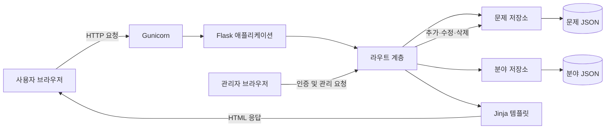
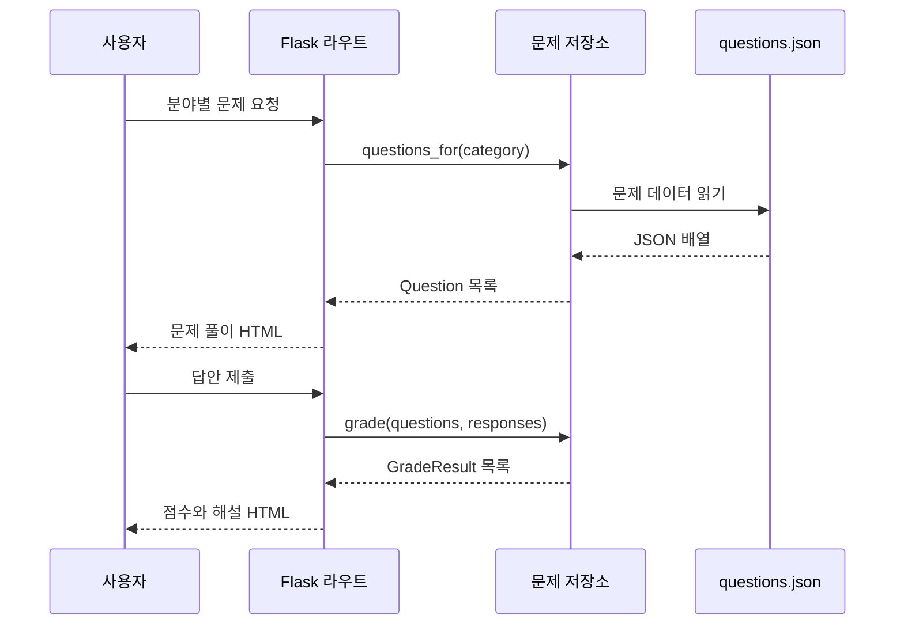

# 시스템 아키텍처

## 1. 목적

이 프로젝트는 머신러닝 수업의 중간고사 범위를 분야별로 복습하는 웹 애플리케이션이다. 사용자는 객관식 문제를 풀고 즉시 채점 결과와 해설을 확인할 수 있다. 비밀번호로 보호된 관리 화면에서는 문제를 추가, 수정, 삭제할 수 있다.

현재 문제 범위는 다음과 같다.

- 머신러닝 기초
- 데이터와 피처
- NumPy
- pandas
- 데이터 시각화

## 2. 전체 구성



애플리케이션은 서버 측 렌더링 방식으로 동작한다. 서버는 문제 조회, 채점, 관리자 인증과 문제 관리를 담당하고, 화면은 Jinja 템플릿을 통해 HTML로 생성한다. 데이터베이스는 사용하지 않으며 문제 데이터는 UTF-8 JSON 파일에서 읽고 원자적으로 교체 저장한다.

## 3. 디렉터리와 책임

| 경로 | 책임 |
| --- | --- |
| `app/__init__.py` | 애플리케이션 팩토리 생성, 경로 설정, 문제 저장소 주입, 블루프린트 등록 |
| `app/routes.py` | HTTP 요청 처리, 문제 조회, 채점 요청 연결, 템플릿 렌더링 |
| `app/admin_routes.py` | 관리자 로그인, CSRF 검증, 문제 추가·수정·삭제 요청 처리 |
| `app/services/category_repository.py` | 분야 JSON 초기화, 조회, 중복 검증 및 추가 저장 |
| `app/services/question_repository.py` | JSON 로드 및 검증, 분야별 조회, 답안 채점, 문제 변경 저장 |
| `app/services/login_attempt_tracker.py` | 접속 주소별 로그인 실패 횟수 및 임시 차단 관리 |
| `data/questions.json` | 객관식 문제와 정답 및 해설 저장 |
| `data/categories.json` | 기본 분야 ID와 표시 이름 저장 |
| `templates/` | 공개 화면과 관리자 화면의 HTML 템플릿 |
| `static/` | 공통 스타일과 문제 JSON 생성 스크립트 |
| `tests/` | 주요 화면과 채점 흐름에 대한 자동화 테스트 |
| `wsgi.py` | Gunicorn이 불러오는 WSGI 진입점 |
| `Dockerfile` | Python 3.13 기반 운영 이미지 정의 |
| `docker-compose.yml` | 웹 서비스 실행 및 호스트 포트 연결 |

## 4. 애플리케이션 계층

### 웹 계층

`app/routes.py`의 Flask 블루프린트가 요청을 받는다. 웹 계층은 입력 분야를 확인하고 저장소에 조회 또는 채점을 요청한 뒤, 결과를 템플릿에 전달한다.

| 방식 | 경로 | 동작 |
| --- | --- | --- |
| `GET` | `/` | 분야별 문제 수와 학습 시작 화면 표시 |
| `GET` | `/quiz?category={분야}` | 선택한 분야 또는 전체 문제 표시 |
| `POST` | `/result` | 제출한 답안을 채점하고 해설 표시 |
| `GET` | `/question-form` | 문제 데이터 작성 양식 표시 |
| `GET`, `POST` | `/admin/login` | 관리자 비밀번호 확인 및 세션 시작 |
| `GET` | `/admin?category={분야}&page={번호}` | 분야별 필터와 페이지가 적용된 문제 목록 및 관리 작업 표시 |
| `GET`, `POST` | `/admin/categories/new` | 새 분야 입력 및 저장 |
| `GET`, `POST` | `/admin/questions/new` | 문제 추가 폼 표시 및 저장 |
| `GET`, `POST` | `/admin/questions/{문제 ID}/edit` | 기존 문제 수정 |
| `GET`, `POST` | `/admin/questions/{문제 ID}/delete` | 삭제 확인 및 삭제 |
| `POST` | `/admin/logout` | 관리자 세션 종료 |

존재하지 않는 분야의 문제를 요청하면 `404` 응답을 반환한다.

### 서비스 및 데이터 계층

`QuestionRepository`가 문제 데이터 접근과 채점을 한곳에서 담당한다.

1. `pathlib.Path`로 `data/questions.json`을 UTF-8로 읽는다.
2. 최상위 배열, 필수 필드, 선택지, 정답 인덱스와 문자열 타입을 검증한다.
3. 검증한 값을 불변 데이터 클래스인 `Question`으로 변환한다.
4. 분야별 조회 결과 또는 `GradeResult` 채점 결과를 반환한다.
5. 관리자 변경 요청은 스레드 잠금 안에서 처리하고 임시 파일을 완성한 뒤 기존 JSON을 교체한다.

문제 데이터는 다음 필드를 사용한다.

| 필드 | 형식 | 설명 |
| --- | --- | --- |
| `id` | 문자열 | 문제를 구분하는 고유 식별자 |
| `category` | 문자열 | URL과 필터에 사용하는 분야 식별자 |
| `category_name` | 문자열 | 화면에 표시하는 분야 이름 |
| `prompt` | 문자열 | 문제 내용 |
| `choices` | 문자열 배열 | 두 개 이상의 선택지 |
| `answer` | 정수 | 0부터 시작하는 정답 선택지 인덱스 |
| `explanation` | 문자열 | 채점 후 표시하는 해설 |

`CategoryRepository`는 문제와 독립적으로 분야를 관리한다. 이 구조를 통해 문제가 아직 없는 새 분야도 홈과 관리자 화면에 유지된다. 분야 데이터는 `id`, `name` 필드로 구성하며, 분야 추가 시 ID와 대소문자를 구분하지 않은 이름의 중복을 검사한다.

## 5. 주요 요청 흐름

### 문제 풀이와 채점



### 문제 관리

관리자는 환경변수에 등록된 비밀번호로 로그인한다. 로그인 성공 여부는 Flask가 서명한 세션 쿠키에 저장되고 30분 후 만료된다. 추가·수정·삭제와 로그아웃 요청은 세션별 CSRF 토큰을 검증한다. 같은 접속 주소에서 5분 안에 로그인에 5번 실패하면 추가 시도를 임시 차단한다.

분야 추가 화면에서 새 ID와 표시 이름을 저장하면 홈, 문제 추가 폼, JSON 작성 양식에 즉시 반영된다. 문제가 없는 분야는 홈에서 `준비 중`으로 표시한다.

문제 추가 화면은 분야별로 `분야-숫자` 형식의 가장 큰 ID를 찾아 다음 번호를 추천한다. 사용자가 추천 ID를 직접 수정한 경우에는 분야를 변경해도 입력값을 덮어쓰지 않는다.

문제 관리 목록은 URL의 `category`, `page` 쿼리로 분야 필터와 페이지 상태를 유지한다. 한 페이지에는 최대 10개 문제를 표시하며, 잘못된 분야는 전체 분야로, 범위를 벗어난 페이지는 가장 가까운 유효 페이지로 보정한다.

문제 변경은 `QuestionRepository`를 통해 즉시 JSON에 반영된다. Docker 환경에서는 `/app/data` 이름 있는 볼륨이 문제 데이터를 유지하므로 컨테이너와 이미지를 다시 만들어도 관리자 변경 내용이 남는다.

## 6. 배포 구조

Docker 이미지는 `python:3.13-slim`을 기반으로 하며 Gunicorn을 통해 애플리케이션을 실행한다.

- 컨테이너 내부 포트: `8000`
- Gunicorn 워커: `1`
- 워커 스레드: `4`
- 요청 제한 시간: `30초`
- 실행 사용자: 비루트 사용자 `appuser`
- 재시작 정책: `unless-stopped`
- 영속 데이터: `question_data` 이름 있는 볼륨의 `/app/data/questions.json`, `/app/data/categories.json`
- 필수 환경변수: `ADMIN_PASSWORD`, `SECRET_KEY`

워커 수는 Cafe24 서버의 1GB RAM 제한을 고려한 값이다. Compose 구성은 호스트의 루프백 주소에만 `8000` 포트를 연결한다. `yangsong.cloud`에서는 운영 서버 앞단의 Nginx 리버스 프록시와 TLS 인증서를 통해 접근한다.

## 7. 상태와 보안 경계

- 일반 사용자의 답안과 학습 기록은 저장하지 않는다.
- 답안과 점수는 요청 처리 중에만 사용하며 서버에 저장하지 않는다.
- 관리자 인증은 서명된 세션 쿠키를 사용하며 `HttpOnly`, `SameSite=Lax` 속성을 적용한다. 운영 HTTPS 환경에서는 `Secure` 속성도 활성화한다.
- 모든 관리자 변경 요청은 CSRF 토큰을 검증한다.
- 비밀번호는 일정 시간 비교 방식으로 확인하며 반복 로그인 실패를 제한한다.
- 비밀키와 관리자 비밀번호는 환경변수로만 주입하고 코드와 이미지에 포함하지 않는다.
- 운영 컨테이너는 비루트 사용자로 실행한다.

## 8. 검증 방법

로컬 자동화 테스트는 다음 명령으로 실행한다.

```powershell
.\.venv\Scripts\python.exe -m pytest -q
```

컨테이너 구성은 다음 명령으로 빌드하고 실행한다.

```powershell
docker compose up --build -d
```

현재 자동화 테스트는 공개 문제 풀이와 채점, 관리자 인증 보호, CSRF 거부, 분야 추가, 문제 추가·수정·삭제와 JSON 반영을 검증한다. 배포 검증에서는 주요 경로의 HTTP 상태, 관리자 로그인, 잘못된 분야의 `404` 응답, 컨테이너 실행 사용자와 Gunicorn 로그를 함께 확인한다.

## 9. 확장 시 고려 사항

- 문제 수가 커지거나 여러 관리자가 동시에 편집해야 하면 JSON 저장소를 데이터베이스 저장소로 교체한다.
- 사용자별 오답 기록이 필요해지면 인증과 영속 저장 계층을 별도로 추가한다.
- 관리자 계정이 여러 개 필요해지면 단일 환경변수 비밀번호를 사용자별 암호 해시 기반 인증으로 교체한다.
- 실제 도메인 배포 시 리버스 프록시, HTTPS, 접근 로그, 백업 및 상태 확인 경로를 추가한다.
